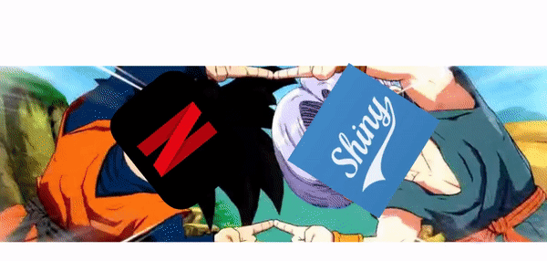

# Netflex - A R Shiny/Flexdashboard project

## App access

You can access the **Netflex** application on [shinyapps.io](https://ibrahimasow.shinyapps.io/Netflex/)

## Description

This project consists in the creation of a Shiny/Flexdashboard app for visualization and analysis of Netflix data made avalaible by the download of our own viewing data. 
This project is only intended for educational purposes.

The app is made of 4 tabs:
  * **Home page**: link to the GitHub repo, and some quanti stats
  * **Explanatory visualization**: You can choose two visualize data from all or only one profile. With again 3 tabs:
    * **Visu**: Allows to visualize data in temporal graphs, with the possibility to choose the temporal scale (All time, during the year, during the week, during one day)
    * **Wordcloud**: Show a wordcloud of the film/serie genres, with word size proportional to their frequency in the data
    * **Mapping**: Display a map of the world with the different countries where people have watched Netflix
    *Note: Mapping is not implemented in the basic version due to is huge loading time, you can see it by uncommenting the corresponding code*
  * **Analysis**: A button *Drop Valentin!* was added two allow to remove this user data from the dataset as it can impede the visualisation
    * **Baloon**: A balloon plot showing the contingency table by genre and user.
    * **CA** (*Correspondance Analysis*):   The graph with the firsts two components with users and genre
    * **Biplot col**: Same but with only the genres
    * **Biplot row**: Same but with only the users
    * **HCPC**: A dendrogram of the HCPC clustering
    * **Clusters**: Visualisation of the users clusters on the firsts two components
  * **Data source**: A *data.table* showing the raw data
## Other files

**matrix.R**: This file is used to build the contingency table between user and genre.

**preprocess.Rmd**: This file was used to preprocess the Netflix data and link it to the imDb API. Use at your own risk, a lot of changes will probably need to be made.

## Credits

[Guilhem HUAU](https://github.com/Glastos)

[Amelie ROBINET](https://github.com/ramelie)

[Ibrahima SOW](https://github.com/sow-ibrahima)

## Licence

This project is protected under the GNU General Public License v3.0.
